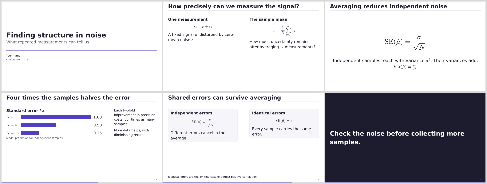

# sci-mosaic

Scientific talks for [Typst](https://typst.app/), built on
[Mosaic](https://github.com/vincentarelbundock/mosaic). The package is two
things: a Mosaic theme with five palettes, and a set of research components
that go inside any cell. Three grids with named cells cover the shapes a
research talk keeps reaching for. Everything else is Mosaic and Typst.

It is a rewrite of [sci-brain-slides](https://github.com/GiggleLiu/sci-brain-slides)
by [GiggleLiu](https://github.com/GiggleLiu), which extracted the design
system from the [sci-brain](https://github.com/QuantumBFS/sci-brain)
`write-slides` skill. The palettes, the components, and the sample talk are
theirs; this package moves them from Touying onto Mosaic and deletes what
Mosaic already provides.



## Get started

Typst 0.15 or newer and [DejaVu Sans](https://dejavu-fonts.github.io/)
(`fonts-dejavu-core` on Debian and Ubuntu; already present in the Typst web
app). Math and monospace fonts ship with Typst.

```sh
typst init @preview/sci-mosaic:0.1.0 my-talk
cd my-talk
typst compile main.typ
```

Compile with `--input theme=dark` or `--input text-size=22` to try another
palette or a larger body size.

## Write a talk

```typst
#import "@preview/sci-mosaic:0.1.0" as sci
#import "@preview/mosaic:0.0.1" as m

#show: sci.setup.with(
  palette: "academic",
  title: [Measuring a noisy signal],
  authors: [Your name],
)
#set text(size: 22pt)

#m.slide(layout: "title")

#m.slide(columns: 2)[
  == What does averaging change?
][
  *One measurement* $ x_i = mu + epsilon_i $
][
  *Many measurements* $ "SE"(hat(mu)) = sigma / sqrt(N) $
]

#m.slide(sci.grids.spread)[
  == Standard error
][
  #sci.figbox([Standard error], image("error.svg"), caption: [Same scale.])
][
  Four times the samples halves the uncertainty.
]

#m.slide(sci.grids.focus, invert: true)[
  Check the noise before collecting more samples.
]
```

A `== Heading` on its own still opens an ordinary content slide, and a
`= Heading` a section slide, exactly as in Mosaic. An explicit `m.slide` does
not absorb a heading written before it, so a heading that belongs to a grid
slide goes in its first cell, as above. `#m.steps.pause` reveals the rest of a
slide on the next frame. `invert: true` flips any slide's polarity.

## What the package exports

**`setup`** applies the theme once. `palette` names one of the four palettes
or takes a palette dictionary; `footer` repeats text at the bottom left of
every numbered slide; `progress` toggles the progress line; `font`,
`font-mono`, and `font-math` name the families. Every other argument is an
ordinary Mosaic `setup` option: `title`, `subtitle`, `authors`, `date`,
`colors`, `handout`, `output`, `overflow`, and so on. Body size is a plain
`#set text(size: 22pt)` after setup; every other size in the theme is an em of
it.

**`palettes`** are plain eight-color dictionaries in Mosaic's vocabulary
(`canvas`, `surface`, `text`, `muted`, `line`, `accent`, `warning`, `error`).

| Palette | Appearance |
|---|---|
| `academic` | Indigo on white |
| `dark` | Pale ink and a gold accent on slate |
| `minimal` | Black on white |
| `vibrant` | Teal on white |
| `brand(primary)` | A palette derived from one house color |

```typst
#show: sci.setup.with(palette: sci.palettes.brand(rgb("#aa1e2b")))
#show: sci.setup.with(palette: sci.palettes.dark + (accent: rgb("#7cc4ff")))
```

**`grids`** are Mosaic grid trees with named cells. Each opens with a
content-sized `header` cell; style a cell by its label.

| Grid | Cells | Use |
|---|---|---|
| `spread` | `header`, `figure` (2fr), `commentary` | Evidence beside interpretation |
| `hero` | `header`, `hero` | One centered equation or claim |
| `focus` | `focus` | One sentence alone; pair with `invert: true` |

```typst
#show label("mosaic-cell-commentary"): set text(size: 0.8em)
```

The header is optional: Mosaic fills the leading cells that have no default,
so `#m.slide(sci.grids.spread)[figure][commentary]` leaves the heading band
empty. Two or three equal columns are `#m.slide(columns: 2)`. Anything else
is an `m.grids` tree composed in place; `sci.grids.header` is the heading
band to open it with.

**Components** take content and semantic arguments, never paint or size. Each
labels its parts (`<sci-callout>`, `<sci-figbox-caption>`,
`<sci-table-highlight>`, ...) and the theme's show rules paint them, so one
rule after `setup` restyles every instance.

| Component | Arguments |
|---|---|
| `callout` | `body, kind: "note" \| "warning" \| "danger" \| "plain", title: none` |
| `figbox` | `title, body, caption: none` |
| `data-table` | `..rows, highlight: ()` — first row is the header |
| `stat` | `value, meaning, unit: none` |
| `punch` | `value, meaning, unit: none, source: none` |
| `spec-list` | `..records` with `term`, `desc`, optional `tag` |
| `theorem`, `definition`, `lemma`, `example`, `proof` | `body, title: none` |
| `conclusion-grid` | `..records` with `label`, `title`, `body`; `highlight: none, columns: 2` |
| `key-links` | `..(label, content)` pairs |
| `pacing` | `minutes` — a cumulative rehearsal clock, counted once per slide |

Cards, quotes, badges, dividers, figures, and progress indicators are Mosaic's
own `m.components`.

**`colors()`** reads the deck's resolved palette inside `context`, for the
figure drawn in Typst that should use the deck accent.

**`diagrams`** holds CeTZ helpers (`canvas`, `tensor`, `state`, `edge`,
`flowbox`) and pinit annotations (`pin`, `highlight`, `note`). `canvas` reads
the palette and states the CeTZ style once, so the helpers name no color:

```typst
#sci.diagrams.canvas(length: 1.5cm, {
  sci.diagrams.tensor((0, 0), "A", [$A$])
  sci.diagrams.tensor((3, 0), "B", [$B$])
  sci.diagrams.edge("A", "B")
})
```

The drawing packages (CeTZ 0.5.2, pinit 0.2.2) load only when these are
called.

**`theme`** is the passive Mosaic definition `setup` was built from, for a
variation that starts there: `m.themes.setup(sci.theme + (colors: ..))`.

The [gallery](gallery.typ) shows every palette, grid, and component; compile it
with `make previews`.

## What changed from sci-brain-slides

- No `deck = setup(..)` dictionary and no destructuring. Mosaic's deck record
  is the only state; `setup` is a show rule.
- No `sizes` token system. Body size is `set text`, everything else is em.
- No `twocol`, `threecol`, `band`, `cards`, `card`, `quote_pull`,
  `progress_dots`, `toc`, `title-slide`, or `focus-slide`: those are
  `m.slide(columns: ..)`, `m.grids`, `m.components`, the `toc` section
  variant, `m.slide(layout: "title")`, and an inverted `focus` grid.
- No `only` and `uncover`. Mosaic's `steps.pause` covers the reveal a research
  talk actually uses; `m.steps.on` and `m.steps.reveal` cover the rest.
- Components take no `fill:` or `size:`; they are labeled and styled by rules.
- Mosaic 0.0.1 needs Typst 0.15 and its API is still moving, so this package
  makes no stability promise before Mosaic 1.0.

## Development

```sh
python3 tests/check.py   # or: make check
make previews            # previews/starter.pdf and previews/gallery.pdf
```

The checks install the working tree into a temporary package path, initialize
a fresh project from the template, compile the README example, the starter in
every palette at three body sizes, and the gallery in every palette with
Mosaic's overflow observation set to error, then exercise invalid inputs.
Python 3.11 or newer is needed only for the checks.

## License

[MIT](LICENSE). Copyright the sci-brain contributors, GiggleLiu and the
sci-brain-slides contributors, and Xuanzhe Xia. Mosaic, CeTZ, and pinit are
distributed under their own licenses.
